<div align="center">


# Inventra

### Plataforma SaaS multi-empresa para inventario, ventas y analítica en tiempo real

[](https://vuejs.org/)
[](https://www.typescriptlang.org/)
[](https://vitejs.dev/)
[](https://pinia.vuejs.org/)
[](https://www.php.net/)
[](https://www.mysql.com/)
[](LICENSE)

**Diseño moderno · Aislamiento por empresa · Auto-refresh · Responsive**

[Demo en vivo](https://ignaciosanchezyuste.es) · [API](https://ignaciosanchezyuste.es/API_Inventra) · [Reportar issue](https://github.com/)

</div>

---

<p align="center">
  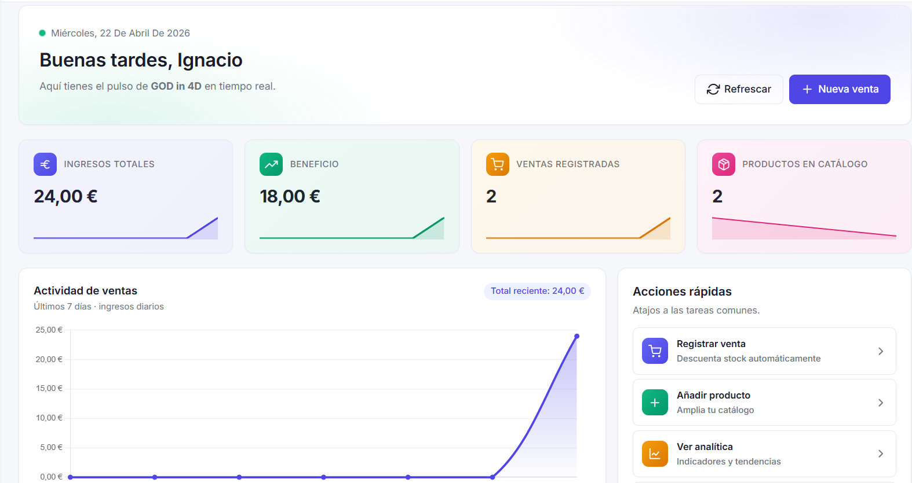
</p>

> 📷 **Captura sugerida:** vista completa del Dashboard con hero, KPIs gradient, gráfica de actividad y panel lateral. Tamaño recomendado: **1600×900**.

---

## ✨ ¿Qué es Inventra?

Inventra es una aplicación web pensada para **pequeñas y medianas empresas** que necesitan controlar su inventario, registrar ventas y entender su rendimiento de un vistazo. Cada empresa funciona como un *tenant* aislado: los datos jamás se mezclan, y el admin invita a su equipo por email.

No es una hoja de cálculo. Es un **producto SaaS real**: dashboard interactivo, punto de venta tipo POS, sistema de invitaciones, roles granulares y actualización automática.

---

## 🎯 Características principales

<table>
<tr>
<td width="33%" valign="top">

### 🏢 Multi-empresa
Cada admin crea su empresa al registrarse. Invita a managers y users por email. Los datos están aislados por `company_id`: nadie ve nada que no sea suyo.

</td>
<td width="33%" valign="top">

### 🛒 POS integrado
Selecciona productos visualmente, monta el carrito, confirma con un clic. El stock se descuenta atómicamente en transacción y la analítica se actualiza al instante.

</td>
<td width="33%" valign="top">

### 📊 Analítica viva
KPIs con gradient + sparklines, line chart de tendencias, doughnut de rentabilidad, bar chart de top productos. Auto-refresh cada 15-20 s y al volver a la pestaña.

</td>
</tr>
<tr>
<td width="33%" valign="top">

### 🔐 Auth + Roles
JWT con expiración automática, guards de ruta y roles claros: **admin** (dueño), **manager** (gestor), **user** (vendedor).

</td>
<td width="33%" valign="top">

### 📨 Invitaciones inteligentes
Si invitas a alguien que ya tiene cuenta, se añade al instante. Si todavía no se ha registrado, queda pendiente y se aplica cuando se registre/inicie sesión.

</td>
<td width="33%" valign="top">

### 📱 Responsive total
Mobile-first con sidebar colapsable, tablas con scroll horizontal, modales con altura máxima y composables de UI adaptados a cada breakpoint.

</td>
</tr>
</table>

---

## 🖼️ Capturas de pantalla

> 📁 Crea la carpeta **`docs/screenshots/`** en la raíz del proyecto y mete dentro las siguientes imágenes con el **nombre exacto** indicado.

### 1. Dashboard
<p align="center">
  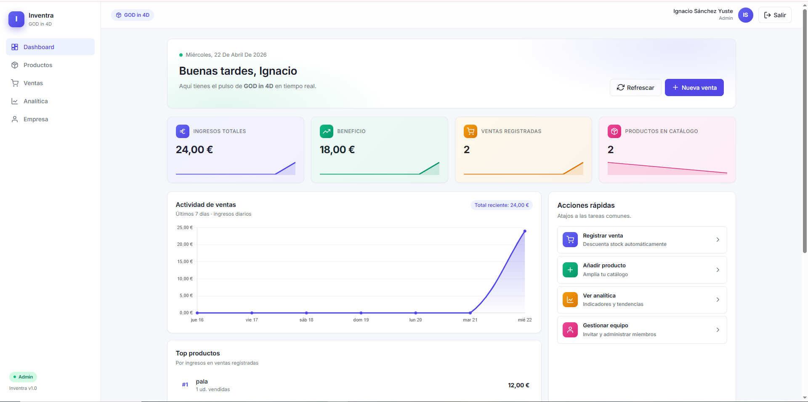
</p>

> 📷 `docs/screenshots/dashboard.png` — Captura entera de la página `/dashboard` con datos cargados (KPIs, line chart de actividad, top productos, stock bajo, feed de actividad). **Tamaño: 1440×900.**

### 2. Productos (modo tarjetas)
<p align="center">
  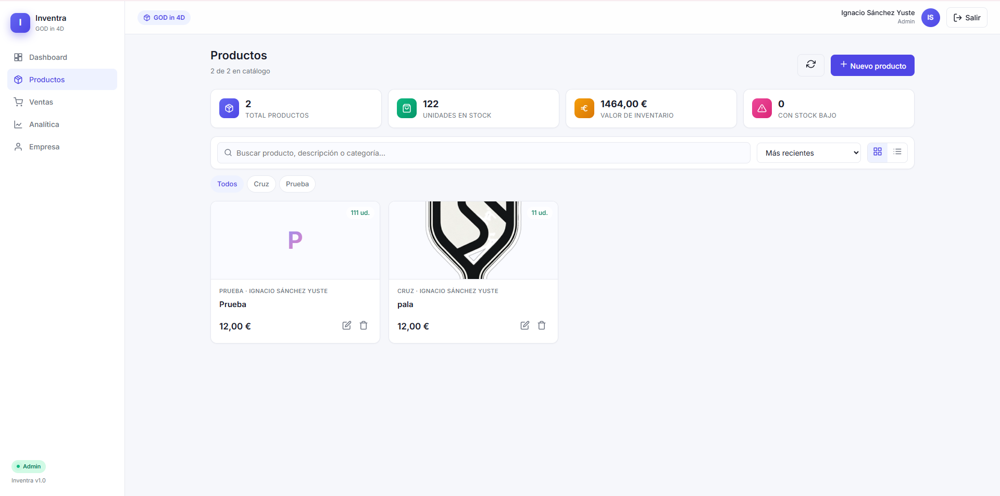
</p>

> 📷 `docs/screenshots/products-cards.png` — Vista `/products` en modo cards con varios productos, mini-stats arriba y pills de categoría visibles. **1440×900.**

### 3. Productos (modo tabla) + modal de creación
<p align="center">
  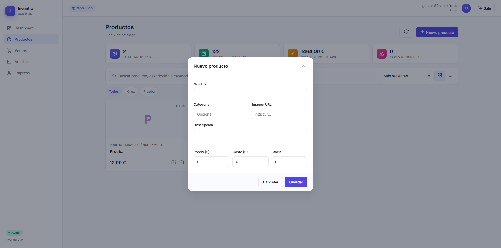
</p>

> 📷 `docs/screenshots/product-modal.png` — Modal "Nuevo producto" abierto encima de la tabla, mostrando todos los campos. **1440×900.**

### 4. Punto de venta (POS)
<p align="center">
  
</p>

> 📷 `docs/screenshots/sales-pos.png` — `/sales` con grid de productos a la izquierda y carrito a la derecha con varias líneas. **1440×900.**

### 5. Analítica
<p align="center">
  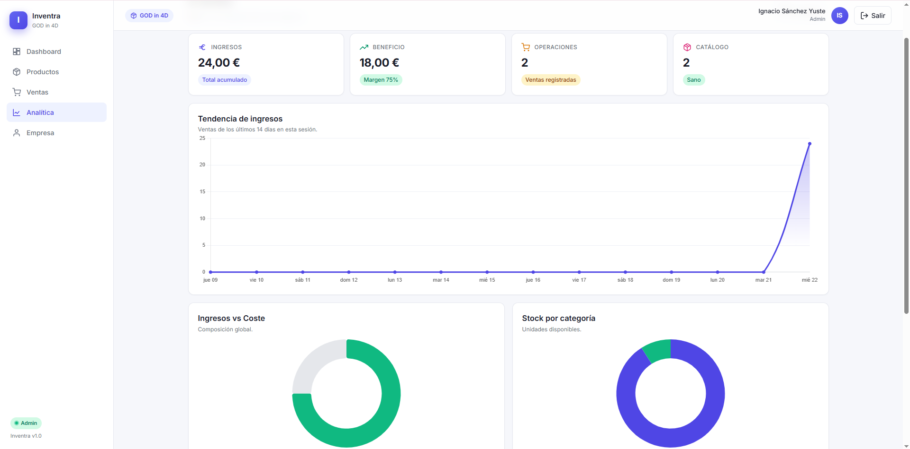
</p>

> 📷 `docs/screenshots/analytics.png` — `/analytics` mostrando los 4 KPIs y los charts (line, doughnut, bar). **1440×900.**

### 6. Empresa (gestión de equipo)
<p align="center">
  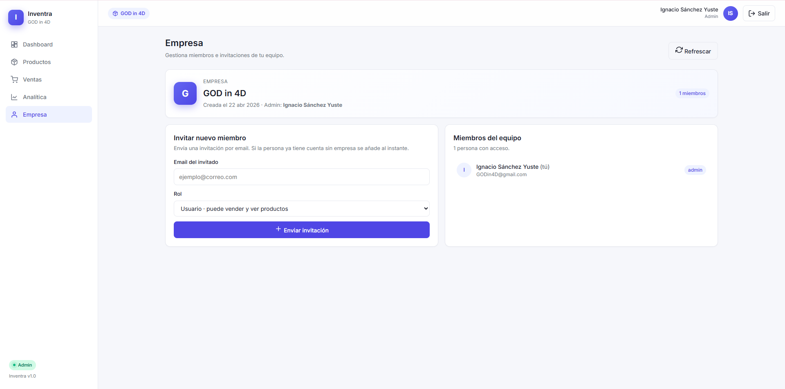
</p>

> 📷 `docs/screenshots/company.png` — `/company` con el card de empresa, formulario de invitación, miembros del equipo e invitaciones pendientes. **1440×900.**

### 7. Login + Registro (mosaico)
<p align="center">
  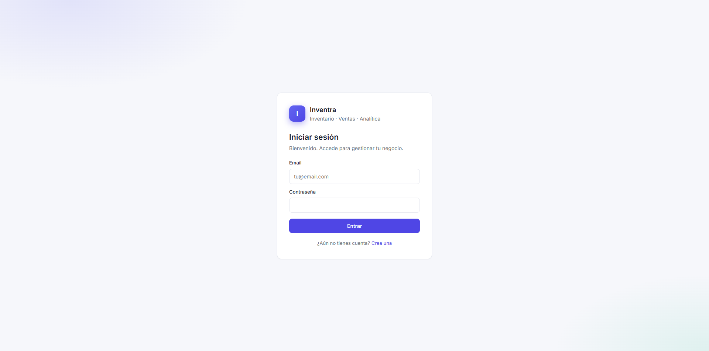
  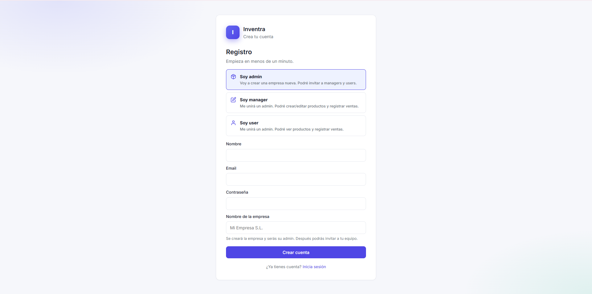
</p>

> 📷 `docs/screenshots/auth-login.png` y `docs/screenshots/auth-register.png` — pantallas de auth. La de registro debe mostrar las tarjetas de elección de rol. **800×900 cada una.**

### 8. Onboarding (esperando invitación)
<p align="center">
  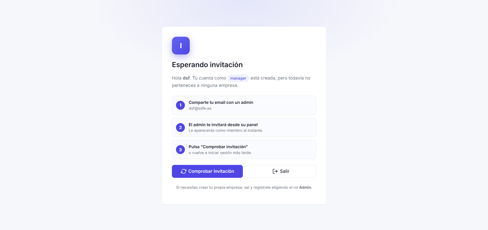
</p>

> 📷 `docs/screenshots/onboarding.png` — pantalla `/onboarding` para usuarios sin empresa. **900×900.**

### 9. Vista responsive (móvil)
<p align="center">
  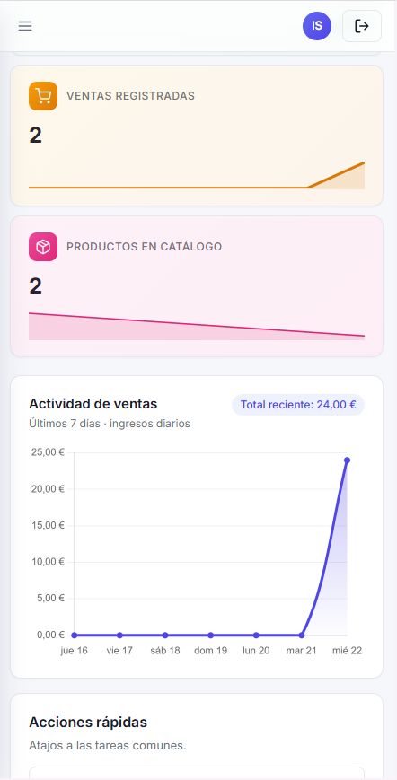
  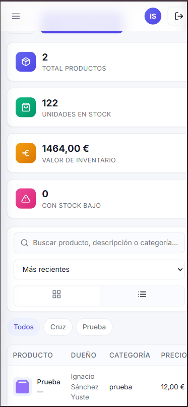
  
  
</p>

> 📷 Cuatro capturas en formato móvil (375×812 estilo iPhone). Una por cada vista clave + el sidebar abierto.

---

## 🧱 Stack técnico

### Frontend
| Tecnología | Uso |
|---|---|
| **Vue 3** (Composition API + `<script setup>`) | UI reactiva |
| **TypeScript** | Type safety end-to-end |
| **Vite 6** | Dev server con HMR + proxy CORS |
| **Pinia** | Gestión de estado (auth, products, sales, analytics, company) |
| **Vue Router 4** | Routing con guards de auth, rol y empresa |
| **Axios** | Cliente HTTP con interceptores y manejo de tokens |
| **Chart.js + vue-chartjs** | Visualizaciones (line, doughnut, bar) |

### Backend
| Tecnología | Uso |
|---|---|
| **PHP 8** + **Slim Framework 4** | Microservicio REST |
| **firebase/php-jwt** | JWT HS256 con expiración 1h |
| **MySQL 8** + **PDO** | Base de datos relacional |

---

## 🏗️ Arquitectura

```
┌─────────────────────────────────────────────────────────────┐
│                       Browser (SPA)                         │
│                                                             │
│   Vue 3 + Pinia + Vue Router        ┌──────────────┐        │
│                                     │   Charts     │        │
│   ┌───────────────┐    ┌──────────┐ │  (Chart.js)  │        │
│   │   API Layer   │───▶│  Stores  │ └──────────────┘        │
│   │   (axios)     │    │ (Pinia)  │                         │
│   └───────────────┘    └──────────┘                         │
│           │                                                 │
│           │ JWT en Authorization header                     │
└───────────┼─────────────────────────────────────────────────┘
            │
            ▼
┌─────────────────────────────────────────────────────────────┐
│                       Backend (PHP)                         │
│                                                             │
│   Slim 4 ──▶ Middleware (Auth, Rol, Company) ──▶ Endpoint   │
│                                                             │
│   ┌─────────────────────────────────────────────────┐       │
│   │  PDO ──▶ MySQL  (companies, users, products,    │       │
│   │                  sales, invitations)            │       │
│   └─────────────────────────────────────────────────┘       │
└─────────────────────────────────────────────────────────────┘
```

### Modelo de datos

```
companies ──┬── 1:N ──▶ users        (admin_id ◀─ 1:1 ─▶ admin user)
            ├── 1:N ──▶ products
            ├── 1:N ──▶ sales
            └── 1:N ──▶ invitations
```

Toda consulta de productos, ventas o analítica se filtra por `company_id` extraído del JWT. **Aislamiento total** entre empresas.

---

## 👥 Sistema de roles

| Rol | Cómo se obtiene | Permisos |
|---|---|---|
| **admin** | Se asigna al registrarse eligiendo "Soy admin" + nombre de empresa. **Crea la empresa.** | Ve todo, crea/edita/borra productos, gestiona miembros, invita por email |
| **manager** | Solo por **invitación** de un admin | Ve y vende, crea/edita productos, accede a analítica |
| **user** | Solo por **invitación** de un admin | Ve productos y registra ventas |

> ℹ️ Si un manager o user se registra sin invitación previa, ve la pantalla `/onboarding` con instrucciones para que un admin lo invite. La invitación se aplica automáticamente al volver a iniciar sesión o pulsar "Comprobar invitación".

---

## 🚀 Puesta en marcha

### 1. Backend (PHP + MySQL)

```bash
# Sube a tu hosting el contenido de backend/ a la carpeta API_Inventra/
backend/
├── index.php          # API completa
├── schema.sql         # Esquema desde cero (DROP + CREATE)
└── migration.sql      # Migración no destructiva si ya tienes datos

# En el hosting, dentro de API_Inventra/:
composer require firebase/php-jwt slim/slim slim/psr7

# Importa el SQL en phpMyAdmin
mysql -u user -p < backend/schema.sql

# Crea Conexion.php con tus credenciales (no incluido en repo)
```

### 2. Frontend (Vue + Vite)

```bash
# Clonar e instalar
git clone <repo>
cd Inventra
npm install

# Configurar .env
echo "VITE_API_BASE_URL=/api" > .env
echo "VITE_API_PROXY_TARGET=https://tu-dominio.com" >> .env

# Dev server (http://localhost:5173)
npm run dev

# Build de producción
npm run build
# Sube dist/ a tu hosting
```

### Variables de entorno

| Variable | Por defecto | Descripción |
|---|---|---|
| `VITE_API_BASE_URL` | `/api` | URL base donde la app llama a la API |
| `VITE_API_PROXY_TARGET` | `https://ignaciosanchezyuste.es` | Dominio destino del proxy de Vite (solo dev) |
| `VITE_BASE_PATH` | `/Inventra/` (prod) | Subpath donde se sirve el SPA |

---

## 📡 Endpoints de la API

> Base URL: `https://tu-dominio.com/API_Inventra`

| Método | Ruta | Auth | Rol | Descripción |
|---|---|:---:|:---:|---|
| `GET`  | `/` | — | — | Documentación viva |
| `POST` | `/auth/register` | — | — | Crear cuenta (admin → crea empresa) |
| `POST` | `/auth/login` | — | — | Login → devuelve JWT |
| `GET`  | `/me` | ✅ | * | Usuario actual + token nuevo si cambió empresa |
| `GET`  | `/company` | ✅ | * | Datos de la empresa actual |
| `GET`  | `/company/members` | ✅ | admin | Listar miembros |
| `DELETE` | `/company/members/{id}` | ✅ | admin | Expulsar miembro |
| `GET`  | `/company/invitations` | ✅ | admin | Listar invitaciones |
| `POST` | `/company/invitations` | ✅ | admin | Invitar por email + rol |
| `DELETE` | `/company/invitations/{id}` | ✅ | admin | Revocar invitación |
| `GET`  | `/products` | ✅ | * | Productos de la empresa |
| `POST` | `/products` | ✅ | admin/manager | Crear producto |
| `PUT`  | `/products/{id}` | ✅ | admin/manager | Editar producto |
| `DELETE` | `/products/{id}` | ✅ | admin | Borrar producto |
| `GET`  | `/sales` | ✅ | * | Histórico de ventas |
| `POST` | `/sales` | ✅ | * | Registrar venta (transacción + descuento de stock) |
| `GET`  | `/analytics/summary` | ✅ | admin/manager | Ingresos, beneficio, ventas, stock bajo |

`* = cualquier rol con empresa asignada`

---

## 📁 Estructura del proyecto

```
Inventra/
├── backend/                    # API PHP (subir a hosting aparte)
│   ├── index.php
│   ├── schema.sql
│   └── migration.sql
├── docs/screenshots/           # 📷 Capturas para el README
├── public/
├── src/
│   ├── api/                    # Capa HTTP (axios + endpoints + types)
│   │   ├── http.ts
│   │   ├── auth.ts
│   │   ├── company.ts
│   │   ├── products.ts
│   │   ├── sales.ts
│   │   ├── analytics.ts
│   │   └── types.ts
│   ├── store/                  # Pinia stores
│   │   ├── auth.ts             # JWT, login, logout, persistencia
│   │   ├── company.ts          # Empresa, miembros, invitaciones
│   │   ├── products.ts
│   │   ├── sales.ts
│   │   └── analytics.ts
│   ├── router/
│   │   └── index.ts            # Guards: auth + rol + empresa
│   ├── layouts/
│   │   └── AppLayout.vue       # Sidebar + topbar + transiciones
│   ├── views/                  # Páginas (lazy-loaded)
│   │   ├── LoginView.vue
│   │   ├── RegisterView.vue
│   │   ├── OnboardingView.vue  # Pantalla "esperando invitación"
│   │   ├── DashboardView.vue   # Hero + KPIs + line chart + paneles
│   │   ├── ProductsView.vue    # Cards/tabla + filtros + modales
│   │   ├── SalesView.vue       # POS + carrito + histórico
│   │   ├── AnalyticsView.vue   # Charts (line, doughnut, bar)
│   │   └── CompanyView.vue     # Gestión de equipo
│   ├── components/             # UI compartida
│   │   ├── Icon.vue            # Librería de iconos SVG inline
│   │   ├── Modal.vue
│   │   ├── ConfirmModal.vue
│   │   ├── ProductFormModal.vue
│   │   ├── StockBadge.vue
│   │   ├── Sparkline.vue       # SVG sparkline
│   │   └── ToastStack.vue
│   ├── utils/
│   │   ├── format.ts           # money(), fmtDate(), num(), decodeJwt()
│   │   ├── series.ts           # dailyBuckets(), topProducts()
│   │   ├── toast.ts            # Sistema de notificaciones
│   │   └── useAutoRefresh.ts   # Composable de polling
│   ├── style.css               # Design tokens + utilidades globales
│   ├── main.ts
│   └── App.vue
├── .env
├── package.json
├── vite.config.ts
└── README.md
```

---

## 🎨 Sistema de diseño

Inventra usa un set de **design tokens** definidos en `src/style.css`:

```css
--primary: #4f46e5     --success: #10b981
--warning: #f59e0b     --danger: #ef4444
--surface: #ffffff     --surface-2: #fafbff
--radius: 12px         --radius-sm: 8px
--shadow-sm / --shadow / --shadow-lg
```

Los gradientes (`g-indigo`, `g-green`, `g-amber`, `g-pink`) se usan en KPIs e iconos para una identidad visual consistente.

---

## 🔄 Flujo de actualización en tiempo real

Inventra implementa un **auto-refresh híbrido** para que múltiples usuarios de la misma empresa vean cambios sin recargar:

1. `useAutoRefresh()` (composable) lanza un `setInterval` cada **15-20 segundos** mientras la pestaña está visible.
2. Escucha `visibilitychange` y refresca al instante cuando vuelves al tab.
3. Cada mutación local (crear producto, registrar venta) actualiza el store y dispara invalidaciones cruzadas.
4. Al cambiar de cuenta o de empresa, el store de auth resetea **todos** los caches de Pinia para evitar fugas de datos.

---

## 🛡️ Seguridad

- **JWT HS256** con secreto en variable de entorno y expiración de 1 hora.
- Auto-logout en cliente cuando el token expira o el backend devuelve 401.
- **Aislamiento por `company_id`**: el backend extrae el `company_id` del JWT, y todas las queries lo aplican como filtro obligatorio (middleware `requireCompany`).
- Las contraseñas se almacenan con `password_hash()` (bcrypt).
- CORS configurado en cabeceras y en `.htaccess` para evitar bloqueo en errores 4xx/5xx.
- Validación de inputs (email, campos requeridos, ownership) en cada endpoint mutador.

---

## 📜 Scripts npm

| Comando | Acción |
|---|---|
| `npm run dev` | Servidor de desarrollo con HMR + proxy a la API |
| `npm run build` | Type-check (`vue-tsc`) + bundle de producción |
| `npm run preview` | Sirve el `dist/` localmente |

---

## 🤝 Contribuir

1. Fork del repo
2. `git checkout -b feature/mi-mejora`
3. Commit: `git commit -m "feat: descripción"`
4. Push: `git push origin feature/mi-mejora`
5. Abre un Pull Request

---

## 📄 Licencia

[MIT](LICENSE) — uso libre con atribución.

---

<div align="center">

**Hecho con 💜 por [Ignacio Sánchez Yuste](mailto:ignaciosanchezyuste@gmail.com)**

⭐ Si te resulta útil, deja una estrella en el repositorio.

</div>
